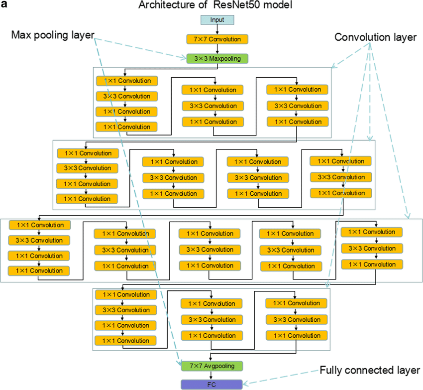
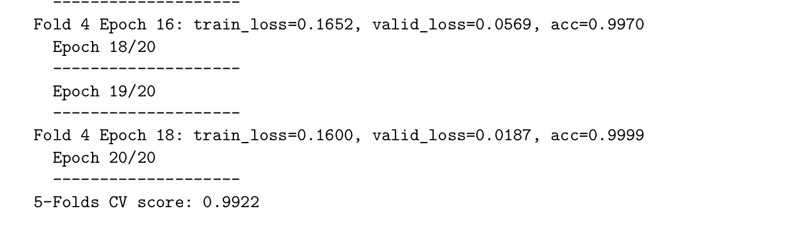

<!-- PROJECT SHIELDS -->
<!--
*** I'm using markdown "reference style" links for readability.
*** Reference links are enclosed in brackets [ ] instead of parentheses ( ).
*** See the bottom of this document for the declaration of the reference variables
*** for contributors-url, forks-url, etc. This is an optional, concise syntax you may use.
*** https://www.markdownguide.org/basic-syntax/#reference-style-links
-->
[![Contributors][contributors-shield]][contributors-url]
[![Stargazers][stars-shield]][stars-url]
[![Forks][forks-shield]][forks-url]
[![Apache License][license-shield]][license-url]

Programming language:  with 

Open project with Google Colab [](https://colab.research.google.com/github/nhutnamhcmus/lab-01-regression/blob/main/source_code/introduction_to_machine_learning_project_01_regression.ipynb)

# ĐỒ ÁN THỰC HÀNH 02 - PHÂN LỚP (CLASSIFICATION)

Lớp: Nhập môn Học Máy - CQ2018/21

Năm: 2021

## Bài toán

Trong nộng nghiệp, năng suất của cây trồng phụ thuộc rất nhiều vào thời
tiết, chế độ chăm sóc, sâu bệnh,… để tăng năng suất người trồng cần có những
biện pháp hạn chế những tác động của các yếu tố trên.

Tuy nhiên, bản thân cây trồng cũng có những loại bệnh nhất định và thường
biểu hiện ra bên ngoài trên thân, lá… những biểu hiện đó bất thường trên cây
trồng thường liện quan tới một loại bệnh nào đó.

Nhằm giúp người trồng xác định được loại bệnh đang có trên cây trồng,
sinh viên được cung cấp tập dữ liệu hình ảnh về các loại bệnh trên cây và tập dữ
liệu đã được xác định được loại bệnh (```train.csv``` và ```test.csv```) bao gồm 4 loại:
- Combinations
- Healthy
- Rust
- Scab

Xây dựng mô hình mạng nơ-rơn để xác định loại bệnh cho một ảnh đầu vào bất
kỳ.

## Mục tiêu
| #   | Nội dung                                                        |  Tình trạng 🔨 |
| --- | ---------------------------------------------------------------------------- | ------------ |
| 1   | Nhận diện bài toán: Sinh viên cần tìm hiểu bài toán và dữ liệu đưoc giao nhằm xác đinh nội dung và ý nghĩa bài toán thực tế cần giải quyết. Thông qua đó, sinh viên có khả năng ánh xạ vấn đề thực tế sang bài toán lập trình.       |   Hoàn thành       |
| 2   | Giải quyết vấn đề: sinh viên được yêu cầu đưa ra các giải pháp và hướng tiếp cận nhằm giải quyết được yêu cầu bài toán thực tế.      |    Hoàn thành      |
| 3   | Xử lý và phân tích dữ liệu: sinh viên có khả năng xử lý các công cụ phân tích dữ liệu tự động nhằm tìm ra các thông tin hữu ích, các đặc trưng tiềm ẩn ảnh hưởng đến mục tiêu bài toán.       |   Hoàn thành       |
| 4   | Thiết kế và cài đặt các thuật toán đã học: sinh viên được yêu cầu có khả năng đề xuất, triển khai và giải thích các thuật toán mạng Nơron đã học nhằm giải quyết bài toán được giao.       |    Hoàn thành      |

## Yêu cầu

| #   | Nội dung                                                        |  Tình trạng 🔨 |
| --- | ---------------------------------------------------------------------------- | ------------ |
| 1   | Phân tích kỹ bài toán và tập dữ liệu hình ảnh được cung cấp. Chọn lựa và trình bày kiểu mạng nơron để giải quyết bài toán.       |    Hoàn thành      |
| 2   | Cài đặt mạng Nơron       |     Hoàn thành     |
| 3   | Báo cáo kết quả đạt đưoc sau quá trình phân tích và cài đặt.       |    Hoàn thành      |

## Phương pháp tiếp cận

### Phương pháp Học Chuyển Giao - Transfer Learning

Mô hình được đào tạo trước là một mạng đã lưu đã được đào tạo trước đó trên một tập dữ liệu lớn,
thường là trong một nhiệm vụ phân loại hình ảnh quy mô lớn. Bạn có thể sử dụng mô hình được đào
tạo trước như hiện tại hoặc sử dụng học chuyển giao để tùy chỉnh mô hình này cho một nhiệm vụ
nhất định

Nhóm dùng hướng tiếp cận với Reuse Model: Mô hình được huấn luyện trước của mô hình sau đó có thể được sử dụng làm điểm khởi đầu cho một mô hình về nhiệm vụ quan tâm thứ hai. Điều này có thể liên quan đến việc sử
dụng tất cả hoặc các phần của mô hình, tùy thuộc vào kỹ thuật mô hình hóa được sử dụng.

### Mạng Residual Networks (ResNet)



ResNet là từ viết tắt của Residual Network được giới thiệu vào năm 2015 bởi Kaiming He, Xiangyu
Zhang, Shaoqing Ren và Jian Sun trong bài báo của họ "Deep Residual Learning for Image Recognition". Nhóm sử dụng ba loại ResNet là ResNet18, ResNet34, ResNet50 trong huấn luyện mô hình.
### Mạng EfficientNet (EfficientNet B5)


Trong bài báo ICML 2019 "EfficientNet: Rethinking Model Scaling for Convolutional Neural Net-
works"nhóm tác giả Mingxing Tan, Quoc V. Le đề xuất một phương pháp mở rộng mô hình mới sử
dụng hệ số kép đơn giản nhưng hiệu quả cao để mở rộng quy mô CNN theo cách có cấu trúc hơn.
Không giống như các phương pháp tiếp cận thông thường quy mô kích thước mạng một cách tùy ý,
chẳng hạn như chiều rộng, chiều sâu và độ phân giải, phương pháp của chúng tôi chia tỷ lệ đồng nhất
từng thứ nguyên với một tập hợp các hệ số tỷ lệ cố định. Được hỗ trợ bởi phương pháp chia tỷ lệ
mới này và tiến bộ gần đây trên AutoML, chúng tôi đã phát triển một nhóm mô hình, được gọi là
EfficientNets, vượt qua độ chính xác hiện đại với hiệu suất tốt hơn lên đến 10 lần (nhỏ hơn và nhanh
hơn)

## Các kết quả đạt được

Với phương pháp học Transfer Learning với mạng ResNet18, 34, 50 và EfficentNet B5 đã giải quyết
bài toán phân loại lá bệnh một cách tốt với độ chính xác tương đối cao sau 5-Fold là hơn 97%, với kỹ
thuật sử dụng dropout, K-Fold Cross Validation đảm bảo giảm thiểu, tránh overfitting

|  Neural Nets 	|  K-Fold 	|  Epoch/Fold 	|  Cross-Validation Score 	|
|---	|---	|---	|---	|
| ResNet18  	|   5	|  10 	|   0.9739	|
| ResNet34  	|   5	|  10 	|   0.9720	|
| ResNet50  	|   5	|  10 	|   0.9733	|
|   EfficientNetB5	|   5	|   10	|  0.9828 	|

Note: Khi tăng epoch huấn luyện EfficientNet B5 lên 20 epoch mỗi fold, kết quả đạt


## Đóng góp 

- Issue Tracker: github.com/nhutnamhcmus/ml-lab-02-classification/issues
- Source Code: github.com/nhutnamhcmus/ml-lab-02-classification

## Hỗ trợ/ Liên hệ

Mọi thông tin hỗ trợ hoặc liên hệ, xin vui lòng gửi trực tiếp về một trong các email dưới đây:

- Personal email: namle1232000@gmail.com

- Working email: lenam.fithcmus@gmail.com

- Student email: 18120061@student.hcmus.edu.vn

Hoặc tạo một github tracker ở mục Đóng góp

## Giấy phép

Đồ án/ tập tin báo cáo của mình sử dụng với giấy phép MIT LICENSE. Các tài liệu liên quan được dẫn liên kết tham khảo, citi trong file báo cáo và ghi rõ trong mục tham khảo, việc sử dụng các tài liệu này theo phần quy định của các tác giả.

## Lời cám ơn

Trong quá trình thực hiện đồ án này, chúng em đã nhận được rất nhiều sự giúp đỡ cũng như hỗ
trợ từ các thầy cô Trường Đại học Khoa học Tự nhiên, ĐHQG-HCM và các bạn bè trong lớp Nhập
môn Học Máy. Chúng em xin bày tỏ lòng cảm ơn chân thành đến mọi người vì đã giúp đỡ hướng dẫn,
chỉ bảo rất tận tình.

Đặc biệt, chúng em xin bày tỏ lòng biết ơn sâu sắc đến các thầy cô khoa Công nghệ Thông tin,
cụ thể hơn là thầy Bùi Tiến Lên và các thầy hướng dẫn đã giảng dạy rất nhiệt, cung cấp nhiều slides,
tài nguyên học tập cần thiết, tạo điều kiện tốt nhất để chúng em có thể hoàn thành được đồ án này.

Trong quá trình, viết báo cáo này, chúng em không thể tránh khỏi nhiều thiếu sót, hy vọng mong
nhận được góp ý từ thầy để chúng em tiếp tục hoàn thiện hơn đối với đồ án này, cũng như rút kinh
nghiệm cho những đồ án, những báo cáo kế tiếp.

Một lần nữa, cũng không cảm ơn đến gia đình, những người bạn, đã luôn đồng hành giúp đỡ lẫn nhau, để chúng mình có thể hoàn thành đồ án một cách hoàn chỉnh nhất có thể!

<!-- MARKDOWN LINKS & IMAGES -->
[contributors-shield]: https://img.shields.io/github/contributors/nhutnamhcmus/ml-lab-02-classification?style=flat-square
[contributors-url]: https://github.com/nhutnamhcmus/ml-lab-02-classification/graphs/contributors

[forks-shield]: https://img.shields.io/github/forks/nhutnamhcmus/ml-lab-02-classification?style=flat-square
[forks-url]: https://github.com/nhutnamhcmus/ml-lab-02-classification/network/members

[stars-shield]: https://img.shields.io/github/stars/nhutnamhcmus/ml-lab-02-classification?style=flat-square
[stars-url]: https://github.com/nhutnamhcmus/ml-lab-02-classification/stargazers

[license-shield]: https://img.shields.io/github/license/nhutnamhcmus/ml-lab-02-classification?style=flat-square
[license-url]: https://github.com/nhutnamhcmus/ml-lab-02-classification/blob/master/LICENSE